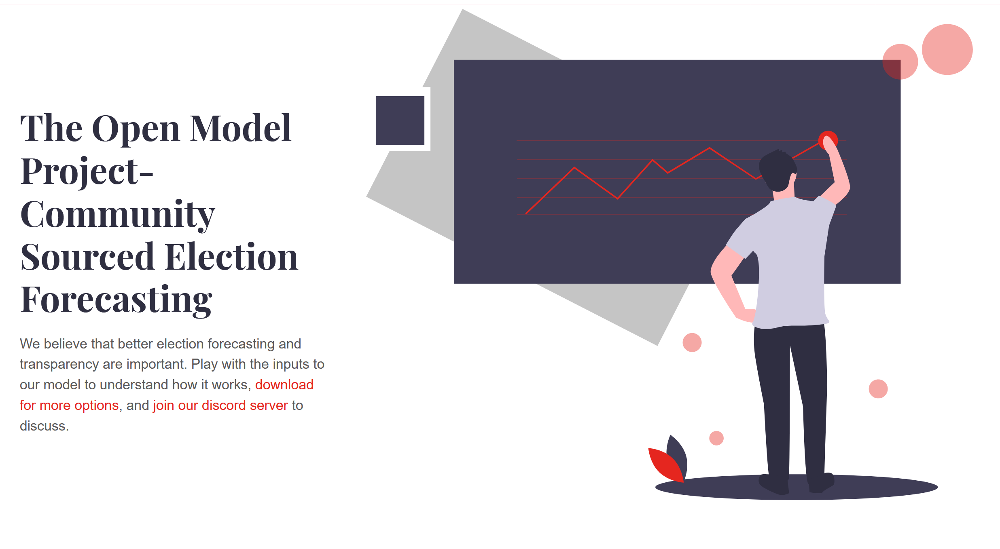

# The Open Model Project


We believe that better election forecasting and transparency are important. Play with the inputs to our model to understand how it works,
[download for more options](https://docs.google.com/spreadsheets/d/1BM-HSoegMc6gxu56LCNnpIlm_b6jlDEtztiQ4EF5jy4/copy), and [join our discord server](https://discord.gg/HrnsJZ5baM) to discuss.



## Installation
This website is built with Jekyll and React.

### Installing Ruby & Jekyll
 
If this is your first time using Jekyll, please follow the [Jekyll docs](https://jekyllrb.com/docs/installation/) and make sure your local environment (including Ruby) is setup correctly.

### Installing Repo

Download or clone the repository.

To run the website locally, navigate to the theme directory and run:

```
bundle install
``` 

To start the Jekyll local development server.

```
bundle exec jekyll serve
``` 

To build the site.
 
```
bundle exec jekyll build
```

## Credits

- Beautiful royalty free Illustrations by [Icons8](https://icons8.com/illustrations/style--pixeltrue) and [undraw.co](https://undraw.co)
- Theme by [Robert Austin](https://jamstackthemes.dev/theme/jekyll-serif/)